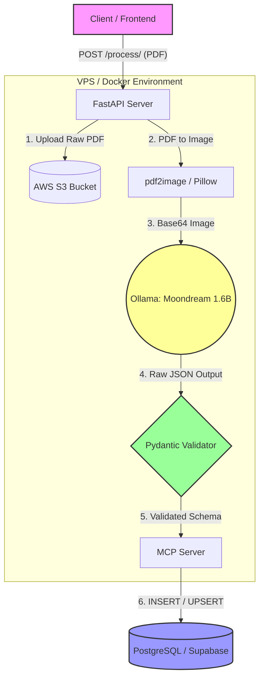

# 📄 E-Commerce Multimodale Verträgen & Rechnungen Pipeline

Eine robuste, Privacy-First End-to-End-Pipeline zur automatischen Extraktion und Strukturierung von E-Commerce-Dokumenten (Verträge, Rechnungen, Lieferscheine). Das Projekt wandelt gescannte PDFs in strukturierte JSON-Daten um, archiviert die Originale in der Cloud und speichert die Metadaten sicher in einer Datenbank.

---

## 🏗️ Architektur & Tech Stack

Die Architektur wurde bewusst für den Betrieb auf ressourcenbeschränkten **CPU-Only VPS-Umgebungen** (wie Hostinger) optimiert, ohne auf Enterprise-Funktionalitäten zu verzichten:

- **API & Validierung (FastAPI & Pydantic V2):** Das Backend nutzt FastAPI für hochperformante, asynchrone Endpunkte. Pydantic V2 erzwingt strikte Typsicherung und validiert die oft unstrukturierten oder halluzinierten Ausgaben von LLMs. Durch den Einsatz von `ConfigDict(populate_by_name=True)` und Fallback-Logik stürzt die Pipeline nicht ab, sondern liefert auch bei teilweiser KI-Fehlleistung ein sauberes, datenbankfähiges Schema (Graceful Degradation).
- **Lokale KI-Inferenz (Ollama & Moondream):** Anstatt auf teure, datenschutzrechtlich bedenkliche Cloud-APIs zu setzen, läuft die Inferenz lokal. Da große Vision-Modelle (wie LLaMA 3.2 11B) auf einem 8GB-RAM-VPS zu OOM-Kills (Out-Of-Memory) führen, wurde bewusst das hochoptimierte `moondream` (1.6B Parameter) gewählt. Dies garantiert minimale Latenz, vollständige Datenhoheit und demonstriert die Fähigkeit, KI-Modelle hardwaregerecht auszuwählen.
- **Cloud-Speicher & Persistenz (AWS S3 & MCP):** Die Original-PDFs werden zur revisionssicheren Archivierung automatisch in einen AWS S3 Bucket hochgeladen. Die extrahierten, validierten Metadaten werden über einen **Model Context Protocol (MCP)** Server standardisiert und sicher in eine PostgreSQL-Cloud-Datenbank (z.B. Supabase) persistiert.
- **Infrastruktur & Orchestrierung (Docker):** Die gesamte Anwendung ist in Docker containerisiert. Dies garantiert eine 100% reproduzierbare Bereitstellung, isoliert Abhängigkeiten (wie `poppler-utils` für die PDF-zu-Bild-Konvertierung) und macht das Projekt sofort auf jedem Cloud-Provider deploybar.

---
## 📊 Systemarchitektur-Diagramm

## Key Features

- Privacy-First: Keine Dokumentendaten verlassen den Server. Die KI-Inferenz läuft zu 100% lokal.

- Hardware-Optimized: Speziell für CPU-Umgebungen mit begrenztem RAM (<8GB) konfiguriert (Anti-Loop-Penalties, Image-Downscaling).

- Robust Error Handling: Die Pipeline fängt KI-Halluzinationen, Timeouts und Formatierungsfehler ab, ohne den gesamten Prozess abzustürzen.

- Plugin-Architektur: S3-Upload und Datenbank-Speicherung sind als austauschbare Plugins (MCP) implementiert.
